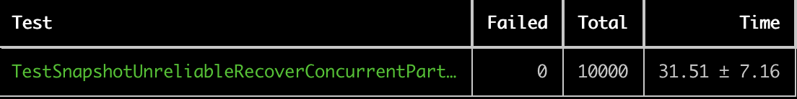
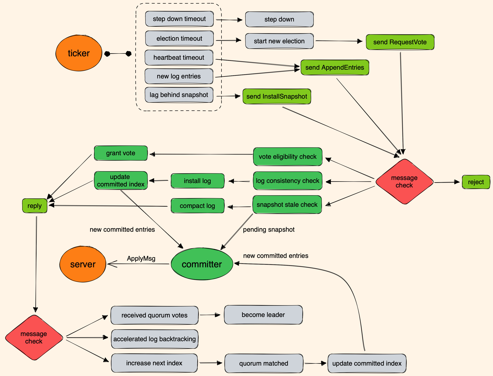
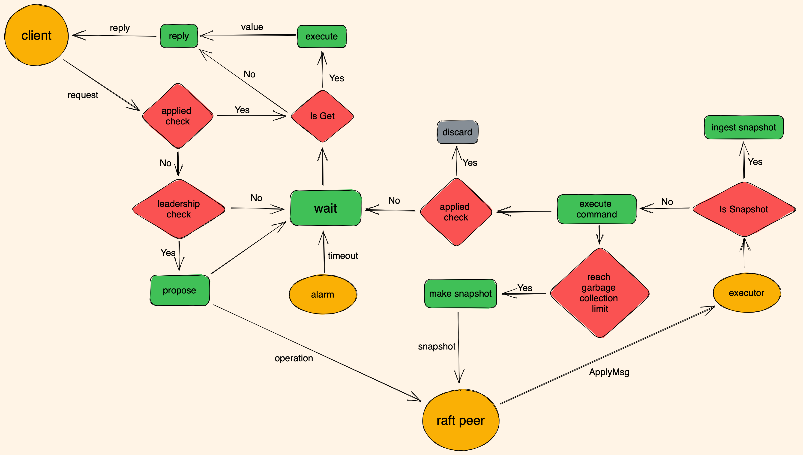

# README

本代码实现了 MIT 6.5840（原 MIT 6.824）分布式系统课程 2023 年版本的 Lab2 Raft 和 Lab3 Fault-tolerant Key-Value Service。关于 Lab4 Sharded Key-Value Service，参考我在 MIT 6.824 2015 Paxos 版本中的实现，其也在总计 30000 次测试中无错误。

[https://github.com/niebayes/MIT-6-824-Paxos](https://github.com/niebayes/MIT-6-824-Paxos)

本代码总共经过 30000 余次测试，代码的正确性和鲁棒性有一定的保证。执行 Lab3 PartB 最后一个测试 10000 次（带 `-race` ）的结果如下。注：执行时间范围偏差较大是因为测试时电脑休眠了几次，导致测试脚本统计出现了问题。

在 `src/raft` 和 `src/kvraft` 文件夹下均配置有 `run_all_tests.sh` 测试脚本。在终端中执行该脚本，即可启动对应 Lab 的测试。

在 lab 的实现过程中，我遇到了很多问题和 bug，对它们也有很多思考。下面我主要以讨论的方式对它们进行描述和总结。

关于 Lab 的一些 instructions，参考：

[https://pdos.csail.mit.edu/6.824/notes/l-raft.txt](https://pdos.csail.mit.edu/6.824/notes/l-raft.txt)

[https://pdos.csail.mit.edu/6.824/notes/l-raft2.txt](https://pdos.csail.mit.edu/6.824/notes/l-raft2.txt)

关于 Raft 和 Lab 的一些 FAQ，参考：

[https://pdos.csail.mit.edu/6.824/papers/raft-faq.txt](https://pdos.csail.mit.edu/6.824/papers/raft-faq.txt)

[https://pdos.csail.mit.edu/6.824/papers/raft2-faq.txt](https://pdos.csail.mit.edu/6.824/papers/raft2-faq.txt)

一个 TA 写的关于 lab 的 guidance，参考：

[https://thesquareplanet.com/blog/students-guide-to-raft/](https://thesquareplanet.com/blog/students-guide-to-raft/)

关于如何更好地输出和分析日志，参考：

[https://blog.josejg.com/debugging-pretty/](https://blog.josejg.com/debugging-pretty/)

## Raft 框架图

## Key-Value Service 框架图

## Figure8 讲了什么？如何规避 figure8 所展示的问题

首先 figure 8 讲了一个什么问题？它假设了这样一个场景：

- (a): S1 在 term 2 作为 leader 成功把第二个 log entry 复制到了 S1 和 S2 上，然后 crash 了。
- (b): 之后 S5 通过 S3, S4, S5 的投票成为了 term 3 的 leader。在 term 3 内，S5 收到了应用层的一个 log entry。但是它还没来得及把这个 log entry 复制给其它 servers 就 crash 了。
- (c) 然后过一段时间，S1 通过 S1, S2, S3 的投票成为了 term 4 的 leader。然后 S1 就继续把它的第二个 log entry，即 term 2 时收到的那个 log entry，尝试复制给其它 servers。假设 S3 收到了这个 log entry。那么当 S1 收到 S3 接受 log entry 的 response 之后，就会更新 match index。那么此时，S1 发现 S1, S2, S3 都把 match index 更新到了 2，那么 S1 就会把 commit index 增加到 2。也就是说，S1 的第二个 log entry 被 commit 了。那么再假设 S1, S2, S3 都把这个 log entry apply 到了 state machine。
- (d) 此时，S1 又 crash 了。然后恰巧，由于 S5 的最后一个 log entry 的 term 为 3，是所有 servers 中最新的 log entry，则 S5 很有可能被选为 term 5 的 leader。然后 S5 就会尝试把自己的第二个 log entry，即 term 为 3 的那个 log entry，复制给其它 servers。其它 servers 不会拒绝这个 log entry，因为根据 prev log index 和 prev log term，这些 servers 的前一个 log entry，即 term 为 1 的那个 log entry，都是相同的。这时，问题就出现了。由于 S1, S2, S3 不会拒绝 S5 的第二个 log entry，那么它们就必须把与之冲突的、自己已经 committed 和 applied、 那个 term 为 2 的 log entry 扔掉。然后把 S5 那个 term 为 3 的 log entry 装上去。当 S5 检测到多数 servers 都复制了这个 log entry 时，S5 就会 commit 进而 apply 它。此时就出现了大问题，因为不同的 servers 竟然在 index 2 处 apply 了不同的 log entry。
    - 在以上描述中，有两个 safety 被破坏了：
        - 一个是 Leader Completeness Safety：明明 S1, S2, S3 已经 commit 了 term 为 2 的那个 log entry，但是这个 log entry 竟然被 discard 了，这就导致它就不可能出现在之后的 leader 的 log 中。
        - 另一个是 State Machine Safety：S1, S2, S3 在 index 2 处 apply 了这个 term 为 2 的 log entry，但是 S4, S5 却在 index 2 处 apply 了 term 为 3 的 log entry。这明显破坏了 replicated state machine 的 safety。
- (e) 考虑到以上场景可能出现，Raft 的作者提出了这样一个解决方案：一个 leader 不能 commit 之前 term 的 log entry。为什么这样有用呢？观察知，正是由于 S1 在 term 4 时 commit 了自己在 term 2 时所收到的 log entry，才导致了后续问题的发生。(e) 这张图就是说，在 term 4 内，如果 S1 把一个 term 4 的 log entry 复制到了大多数 servers，那么在 S1 尝试 commit 这个 term 4 的 log entry 时，term 2 的那个 log entry 也被间接地 commit 了。这是一个 leader 唯一可以 commit 之前 term 的 log entries 的方法。只要保证了这一点，S1 在 term 4 把那个 term 为 2 的 log entry 复制到了大多数，S1 也不会 commit 它。那么即使 S5 在 term 5 发送了一个 term 为 3 的 log entry ，导致 term 为 2 的 log entry 被 discard，也不会影响 safety。因为 term 为 2 的那个 log entry 根本就没有被 commit。

那么，我们在代码中如何实现这样的逻辑呢？

考虑之前是如何 advance committed index 的：判断一个 log entry 是否被 commit，leader 需要遍历所有 followers 的 match index。如果它发现对于一个 N > committed index 的数，大多数 match index 也大于或等于它，即 quorum(match indexes) ≥ N，那么就把 committed index 设置到 N。

现在，我们只需要额外加一个条件判断，即 `quorum(match indexes) >= N && entry.Term == leader term` ，也就是让一个 leader 只能 commit 自己 term 的 log entries。

## 如何实现 log replication？

这里我们讨论如何 handle log replication 过程中发现的 conflict。

在 follower handle append entries request 时，有两个地方可能引发 conflict。一个是 log consistency check。这个 check 只与 leader 发过来的 prev log index、prev log term、以及 follower log 有关，它不涉及到 append entries request 中携带的 leader log entries。关于 log consistency check 以及与之相关的 accelerated log backtracking，之后会有详细的讨论。我们要明确的是，当且仅当 log consistency check 通过了，即确认 leader 与 follower 的 log 在 prev log index 及之前都是一致的情况下，follower 才会考虑 install leader 发送过来的 log entries。否则，follower 会在回复对应的 log consistency check fail 的原因后，中止 handling request。

另一个可能引发 conflict 的地方，就是当 follower 尝试 install leader log entries 时。因为 log consistency check 只保证 log prefix 是一致的，并不保证 log suffix 也是一致的。此时，follower 应一切以 leader 为准。也就是说，一旦发现 follower 的某些 log entry 的 term 与 leader 发送过来的不一致，则需要将这个 log entry 及之后的所有的 log entry 都替换为 leader 的 log entries。此即 conflicts。如果没有发现 conflict，则 follower 不需要对自己的 log 做任何操作。

假设 leader 发送过来的 log entries 中的最后一个 log entry 的 index 为 X。在 log consistency check 成功及 follower install log entries 完毕之后，我们保证 follower 那些 index 在 X 及之前的 log entries 都与 leader 的一致。此时，follower 就可以根据 index X 以及 leader 发送过来的 committed index 中的较小值，去尝试更新 follower 的 committed index。只能根据较小值，是因为 leader 发送过来的 log entries 的一部分 log suffix 可能尚未被 committed。

关于 leader accelerated log backtracking，或称 follower catching up quickly，很多 raft 的实现都不一样。我实现的是 lab spec 说的方法，具体为：

- follower：
    - 如果检测到 follower log 在 prev log index 处没有 log entry，则将 reply 设为 index not matched，表示 follower 的 log 太短。同时，follower 把 last log index 返回给 leader。设该情况为 FA。
    - 如果检测到 follower log 在 prev log index 处有 log entry，但是 log term 与 prev log term 不一致，则将 reply 设为 term not matched，表示发生了 term conflict。同时，follower 会在 log 中找第一个 term 为 prev log term 的 log entry，并将这个 log entry 的 log index 作为 first conflict index 返回给 leader。设该情况为 FB。
    - 将 reply 设为 matched，表示 follower 的 log 与 leader 的 log 在 prev log index 及之前都是 matched。follower 之后需要选择性地 install leader 发过来的 log entries。
- leader：
    - 如果 reply 为 matched，则更新 match index，并尝试更新 committed index。
    - 如果 reply 为 index not matched，则把 next index 设置为 follower 发回的 last log index + 1。设该情况为 LA。
    - 如果 reply 为 term not matched，leader 会在自己的 log 中找是否有 conflict term 的 log entry
        - 如果找到了，则会把 next index 设置为 leader log 中 term 为 conflict term 的最后一个 log entry 的 index。设该情况为 LB。
        - 如果没有找到，则会把 next index 设置为 follower 发回的 first conflict index。设该情况为 LC。

对于为什么需要这样做，我目前并没有发现一个合理的 formal 解释。对于这样做的正确性，我也不能给出一个 formal 的 proof。我只能以我在 debug、分析日志时看到的一些典型场景对这个方法进行阐述。

首先我们考虑什么时候 follower 在接收 append entries RPC 时会发现 log inconsistency。假设一个没有 crash、没有 partition 的场景。集群启动后，一个 follower 竞选为某个 term 的 leader，然后它开始接收 server 的 operations。每接收一个 operation，leader 会把它 wrap 为 log entry，然后 broadcast append entries，以 replicate 这个 log entry。如果由于网络原因，follower 没有收到这个 log entry，则 leader 会重发。当且仅当 leader 收到 follower 成功 replicate 的 reply 后，leader 才会更新关于这个 follower 的 next index。

假设一个 follower 运行很慢，或者被 partition 了，leader 都不会更新关于这个 follower 的 next index。假设一个 follower crash 了，或者刚加入集群，leader 首先会发送一个 install snapshot 给它，待 follower 成功 install snapshot 后，leader 会将 next index 设为 snapshot index + 1。也就是说，不管 follower 发生了，leader 都不会改变 next index，则 leader 发送过来的 append entries 永远不会被 reject。

但是，如果有 crash 或 partition 等情况，集群就可能换新 leader、或者旧 leader 重新竞选为新 leader，那么 `leader 不会改变 next index` 这个 invariant property 就会被破坏，此时 follower 就可能检测到 log inconsistency。下面，我就以几个典型场景分析 accelerated log backtracking 的 reasoning。

场景一：

S1 follower log: 4 5 5 5 5

S2 leader log: 4 5 5 6 6

上面的数字表示 log entry 的 term，每个数字所处的位置表示 log entry 的 index，从左往右从 0 开始计数。

出现这个场景的原因是：S1 在 term 5 时是 leader，然后被 partition 了。在 S1 automatic step down 之前，它接收了来自 server 的两个 operations，并把它们 append 到 log 的最后。之后 S2 通过选举成为了 term 6 的 leader，也接收了来自 server 的两个 operations。

当 partition 恢复之后，S1 收到了 S2 的 append entries，其中 prev log index = 2, prev log term = 5，这是根据 S2 成为 leader 时的 last log index = 2 来设置的。S1 收到以后发现 prev log index 有 log entry，且 term = prev log term，于是 log consistency check 会成功。之后，S1 会把 index = 2 以后的 log suffix 替换为 leader 发送过来的 log entries。

这个场景是最常见的场景，它并不会引发 log consistency check 的 failure，所以它实际上和 accelerated log backtracking 没关系。我把它列出来，是因为它确实很典型。

场景二：

S1 follower log: 4 5 5 5 5

S2 leader log: 4 5 5 6 6

S1、S2 的 log 与场景一完全一致，但是现在情况有一点不同。首先我们重述一下没有变的部分：S1 在 term 5 时是 leader，然后被 partition 了。在 S1 automatic step down 之前，它接收了来自 server 的两个 operations，并把它们 append 到 log 的最后。之后 S2 通过选举成为了 term 6 的 leader，也接收了来自 server 的两个 operations。

S2 在接收到这两个 operations 后，对它们进行 replication。此时，S1 与 S2 之间的 partition 还没有修复，因此 S1 收不到 append entries RPC。过一会，S2 crash 了。之后 S2 restart，然后竞选为 term 7 的 leader，则它会把 next index 初始化为 last log index + 1 = 5。此时，partition 修复了。S2 随即进行了一次 heartbeat，其中 prev log index = 4，prev log term = 6。

S1 收到 heartbeat 后，发现 prev log index 处有 log entry，但是 term ≠ prev log term，即发生了 term conflict，即对应情况 FB。S1 此时会把 first conflict index 设为 1，然后 reply term not matched。

S2 收到 reply 后，发现自己的 log 中有 term = 5 的 log entries，则对应情况 LB。S2 于是把 next index 设置为 2。在随后的 append entries 或 heartbeat 中，prev log index = 1。显然，S1 与 S2 的 log 在 prev log index 及之前都是 matched，则 log inconsistency 被 resolve。

场景三：

S1 follower log: 4 4 4 

S2 leader log: 4 4 4 4 4 

出现这个场景的原因是：S1、S2 在 term 4 较长的一段时间内 log 都是同步的。在此期间，S1 是 follower，S2 是 leader。之后，S1 被 partition 了。在 S1 被 partition 的这段期间，S2 作为 leader 正常接收 server 的 commands。在 append 一些 log entries，S2 crash 了。

过一会，S2 restart，重新竞选为 term = 5 的 leader，并把 next index 初始化为 last log index + 1 = 5。此时，partition 被修复了。随后，S2 进行一次 heartbeat。S1 收到 heartbeat 后，发现 prev log index 处没有 log entry，即发生了 index conflict，即对应情况 FA。S1 则会 reply index not matched，并把 last log index = 3 发回给 S2。

S2 收到 reply 后，对比 leader last log index 和 follower last log index，发现 follower 的 log 确实更短，即对应情况 LA。于是把 next index 设置为 follower last log index + 1。在随后的 append entries 或 heartbeat 中，prev log index = 2。显然，S1 与 S2 的 log 在 prev log index 及之前都是 matched，则 log inconsistency 被 resolve。

场景四：

S1 follower log: 4 4 4 5 5 

S2 leader log: 4 4 4 6 6

出现这个场景的原因是：S1、S2 在 term 4 的较长的一段时间内 log 都是同步的。在此期间，S1 是 leader，S2 是 follower。之后，S2 被 partition 了。S1 随后 crash 了一次，然后又竞选为 term 5 的 leader。在 term 5 期间，S1 接收了来自 server 的两个 operations，但是在 commit 它们之前就被 partition 了。

随后，对 S2 的 partition 修复了，且 S2 竞选为 term 6 的 leader。S2 接收了来自 server 的两个 operations，并 append 了它们。S2 随后又发生了 crash。在 restart 后，S2 竞选为 term 7 的 leader，并把 next index 初始化为 last log index + 1 = 5。此时，对 S1 的 partition 修复了，于是 S1 收到了 S2 的 append entries RPC，其中 prev log index = 4，prev log term = 6。

S1 发现 prev log index 处存在 log entry，但其 term ≠ prev log term，即发生了 term conflict，即对应情况 FB。S1 此时会把 first conflict index 设为 3，然后 reply term not matched。

S2 收到 reply 后，发现自己的 log 中没有 term = 5 的 log entries，则对应情况 LC。S2 于是把 next index 设置为 3。在随后的 append entries 或 heartbeat 中，prev log index = 2。显然，S1 与 S2 的 log 在 prev log index 及之前都是 matched，则 log inconsistency 被 resolve。

通过以上分析，我们发现 lab spec 所给出的 accelerated log backtracking 算法能够应对以上所有场景。当然可能还有很多其它场景，我并没有列举出来，但根据我的测试，该方法应该都能正确应对。下面我们就来讨论这个算法的 reasoning。

为什么 follower 在 index not matched 时，需要发回 last log index 呢？这是因为 leader 发送过来的 prev log index 就是本次 RPC 所携带的最小的 log index。follower 没有足够的信息判断更之前的 log 的 consistency，它唯一能做的就是直接告诉 leader 自己的 last log index，这样 leader 就不需要使用 decrement 来很慢地 backtrack log。

为什么 follower 在 term not matched 时，需要发回 conflict term 和 first conflict index 呢？对于 conflict term，它是为了让 leader 去判断的。对于 first conflict index，为什么是 first，而不是 last 或者其它？这是因为我们 accelerated log backtracking 的目的是尽可能地让 leader 下次发送过来的 append entries 或 heartbeat 不会引发 follower 的 log consistency check fail。由于 follower 与 leader 的一部分 log prefix 肯定是 match 的，因此把 conflict index 设置为 first conflict index 就可以把下一次要匹配的 log prefix 的长度尽可能地缩短，这就提高了下一次 match 的成功率。只要 match 了，那么之后 follower 就可以直接 replace its log with leader’s log。

为什么 leader 在收到 term not matched reply，且发现有 term = conflict term 的 log entry 时，会把 next index 设为 the index of the last log entry with conflict term 呢？为什么是 last？说实话，我并不能给出非常合理的解释。我认为设置为 first 是更保险的行为，因为据上面所述，这样可以缩短下次要匹配的 log prefix 的长度，以提高下次 match 的成功率。但是另一方面，由于存在 log entry，其 term = conflict term，这就表示 leader 与 follower 在 conflict term 时的大部分时间应该都是同步的，即是场景二或类似的场景。那么这种情况下，虽然设置为 first 肯定是更保险的行为，设置为 last 肯定也是正确的行为，并且其可以减少需要发送的 log entries 的数量。

为什么 leader 在收到 term not matched reply，且发现没有 term = conflict term 的 log entry，会把 next index 设为 first conflict index 呢？这个其实应该就是为了应对场景四或类似的场景。如果没有 term = conflict term 的 log entry，而 raft 以 leader 的 log 为准，那么就说明 follower 中 term = conflict term 的 log entries 或许都需要被 discard。那么 follower 把 first conflict index 传给 leader，就是让 leader 通过设置 next index 将 follower 中的 conflict log entries 都跳过，而去直接匹配有可能 match 的 log prefix。故，leader 应该将 next index 设为 first conflict index。这也对应了 raft 论文说的一句话：

> With this information, the leader can decrement nextIndex to bypass all of the conflicting entries in that term; one AppendEntries RPC will be required for each term with conflicting entries, rather than one RPC per entry.
> 

最后，要特别提出的是，不管发生任何情况，leader 都不能把 next index 设为超过 leader last log index + 1，否则可能会发生一些错误，例如 log slicing, indexing 的一些错误。

## 关于 match index 和 next index

match index 是由 leader 用来更新 committed index 的。match index 保证了 leader 与 follower 在 match index 及之前的 log 都是一致的。next index 是用来指示 leader 下一次应该发送 follower 哪些 log entries。

虽然有些时候，我们会根据 match index + 1 来更新 next index，但实际上它们完全不是同一个东西。完全可以合理地认为，它们俩没有任何直接联系。

## 哪些 state 需要被 persist？

### voted for 和 current term

- voted for
    - 考虑这样一个场景：一个 peer 给某个 candidate 投票了，然后 crash。当它 restart 后，又收到了另外一个 candidate 的 request vote。由于没有 persist voted for，那么这个 peer 又会为这个 candidate 投票。显然，这可能会导致同一个 term 内存在多个 leaders，这违反了 safety，即并没有 consensus。
- current term
    - 考虑这样一个场景：集群中有三个 peers A, B, C，它们的 current term 分别为：X, X, Y，其中 X > Y。出现这样 term 情况的一个可能原因是：peers A, B 相互能正常通信，而 peer C 被 partition 了，所以它的 term 没有更新。假设 A 是 term X 内的 leader。当它 crash 和 restart 后，由于没有 persist current term，那么它会从 term 0 开始尝试竞选。对于 peers B, C 而言，它们会因为较长时间没有收到 leader 的 heartbeat，而开始竞选。由于 peer C 被 partition 了，那么它们就会各自独立地 increment term，例如 peer B 从 X → X+1，peer C 从 Y → Y+1。可能会出现这样一种情况：当 peer A 更新 term 到 Y+1 时，peer C 的 partition 被修复了，那么 peer A 的 request vote 就会发送给 peer C。由于 peer A 的 term 与 peer C 的 term 相同，且 peer A 由于是 term X 的 leader，那么它的 log 必定 at least as up-to-date as peer C’s log，因此 peer C 会投票给 peer A。则 peer A 就会成为 term Y+1 的 leader。这会有两个问题：一个是可能有一些 logs 在 term Y+1 之后被 committed 甚至 applied 了，但是由于 peer A 成为了 term Y+1 的 leader，那么这些 logs 就会被错误地 discard（是这样的吗？）。另一个问题是，可能在 term Y+1 时的 leader 之前并不是 A，而是 B，这就违反了 safety，即同一个 term 内存在多个 leaders。

总结而言，raft 的 safety 的关键就在于一个 peer 在一个 term 内最多给一个 peer 投票。可以给同一个 peer 投多次，但是不能给不同的 peers 投票。如此，才能保证一个 term 内最多存在一个 leader。因为 who is leader 本身就是一个 consensus 问题，如果这个都不能保证，那么 raft 作为一个 consensus protocol 本身就是不合格的。如果我们不 persist term，那么重启后的 peers 可能就会给一些 term lag-behind 的 candidates 进行投票，这就有可能破坏 safety。

我们还可以用更宏观的角度去分析，raft 将事件在时间上的先后顺序定义为 (term, votedfor) 这样一个 pair 的偏序。term 越大的，时间上越靠后。votedfor = some candidate id 又大于 votedfor = None。因为时序是一个绝对不能被破坏的顺序，因为时间无法倒退，所以必须要保证 term 和 votedfor 都不会倒退，这就需要 persist 它们。

### committed index 和 applied index

首先要说明的是，以下的讨论建立在 log entries 被 persist 的基础上。

对于 committed index，没有必要 persist 它。对于 leader，它通过 broadcast append entries 或者 heartbeat，可以知道每个 followers 的 match index。再通过 majority 的 min match index，即可知道当前集群的 committed index。对于 follower，通过 leader 发送过来的 committed index，就可以知道 committed index。

但是显然，由于 log entries 被 persist 了，那么再 persist committed index，是很直接的一个行为。如果 persist 了，自然可以省去不少麻烦。所以，很多 raft 的实现都会 persist committed index，我也是这样设计的。

对于 applied index，我们需要考虑 server 层的实现。实际上，raft 层所存储的 applied index 通常是滞后于 server 层的 applied index。raft 层与 server 层大概是这样交互的：

- 某个 raft peer 检测到某个 committed log entry 还没有被 server 所 apply（通过比对 raft 层维护的 committed index 与 applied index），那么它就会把这个 log entry 传输给 server 层。
- server 层收到之后，会检查这个 log entry 是否真的尚未被 apply。
    - 如果是，那么这个 log entry 可能会被立即 apply，也可能会被buffer 在 server 层，待之前的所有 log entries 都被 apply 了之后，再 apply 这个 log entry。
    - 如果已经被 apply 了，那么直接 discard 这个 log entry。
- 每当 server apply 了一个 log entry 后，server 层会通知 raft 层自己已经 apply 到了这个 log entry，此时 raft 层才会更新 applied index。
    - 有些设计会让 server 批量 apply 一些 log entries，然后再通知 raft 层，而不是 apply 一个就通知一次。

那么 applied index 到底要不要 persist 呢？这就要看 server 层的 state machine 的 persist 设计了。

- 如果 state machine 没有 persist 机制，那么 restart 时就需要 replay raft log entries，则 raft 层不能 persist applied index。如果 persist 了，那么 raft 层会错误地认为 server 层已经 apply 了，但实际上 server 层没有。
- 如果 state machine 有 persist 机制，且 server 层自己 persist 了 applied index，那么 raft 层可以 persist applied index 也可以不 persist。不管 raft 层 persist 与否，server 层的 applied index 就保证了 safety，即不会重复 apply 同一个 log entries。当然，如果 raft 层 persist 了applied index，那么 raft 层就可以少发送很多已经 applied log entries 给 server 层，这可以提高性能。

总结而言，committed index 没有必要 persist，但是既然 log entries 被 persist 了，那么 persist committed index 是很自然、直接的行为，可以稍稍提高性能。applied index 要不要 persist，需要看 server 层的 state machine 的 persist 的设计，不能盲目地 persist 了事。所以很多构建在 raft 之上的一些应用，都会把应用层的 storage 和 raft 层的 storage 分开，这给系统设计带来了更高的 flexibility。

在我的设计中，committed index 和 applied index 都没有被 persist。

### log entries

是否 persist log entries，需要看是否 persist applied index，以及看 server 层的 persist 设计。

- 如果 server 层 persist 了 applied index，那么 raft 层就可以从 server 层获知 applied index，则理论上所有 log index up to applied index 的 log entries 都没有必要在 raft 层被 persist。具体而言，这些 log entries 可以从来不被 persist，也可以之前被 persist，但是在获知 server 层的 applied index 之后，discard 这些 log entries。
- 如果 server 层没有 persist 设计，那么在 restart 时就需要 replay raft log entries，那么很显然所有 log index up to applied index 的 log entries 都需要在 raft 层被 persist。因为 applied index 必定大于或等于 committed index，因此 replay 这些 log entries 是 safe 的。

总结而言：

- 对于 log index up to applied index 的 log entries，raft 层是否有必要 persist 它们，取决于 server 层的 persist 设计。但不管 server 层如何设计，raft 层 persist 所有 log index up to applied index 的 log entries 都是 safe 的。
- 对于 log index greater than applied index 的 log entries，可以 persist 它们，因为这并不影响 safety。raft 论文就是将所有 log entries 都 persist。这样做的好处是，如果 log inconsistency 是一个低概率事件，那么大部分 persisted log entries，都是将要被 committed 乃至 applied log entries，所以 persist 它们是完全可以的。相对地，如果 log inconsistency 发生频率较高，那么一些 persisted log entries 就需要被 discard。由于这涉及到 disk io，显然对于性能影响较大。

在我的设计中，考虑到 lab 所提供的 persist 接口的功能是很有限的，我选择 persist 所有 log entries。

在 lab2 中，一旦发生 crash，lab 保证 sever 与 raft 一起 crash，且应用层没有 persistence 机制。tester 会维护一个 cfg，其中有一个 field 为 lastApplied。它是一个 map，key 为 server id，value 为对应的 server 从 raft 层收到的最新的 apply msg 中存储的 command index。在 crash 后 restart 时，lastApplied 会被设置为 0。这即表示应用层没有 persistence 机制。所以 raft 层不能 persist applied index。但是对于 committed index，是没有影响的。raft 层可以 persist 它，也可以不。

## Raft Log 的设计

### TinyKv 和 etcd 中 Raft Log 的设计

在 tinykv 和 etcd 中，所有的 log entries 有三种状态：

- compacted: 所有被 compacted 的 stale log entries。这些 log entries 间接地存储在 snapshot 中。
- persisted: 所有已经被 persisted、且未被 compacted 的 log entries。这些 log entries 存储在 stable storage 中，即 non-volatile storage。
- cached: 所有尚未被 persist、暂存在 memory 中的 log entries。这些 log entries 存储在 unstable storage 中，即 volatile storage。

为了区分这些 log entries，有这些 log indexes：

- snapshot index: 对应 compacted log entries 的最后那个 log entry。
- first stable index: 对应 persisted log entries 的第一个 log entry。
- applied index: 对应被 server 层 applied 的最新的那个 log entry。
- committed index: 对应被 raft 层 committed 的最新的那个 log entry。
- last stable index: 对应 persisted log entries 的最后那个 log entry。
- first unstable index: 对应 cached log entries 的第一个 log entry。
- last unstable index: 对应 cached log entries 的最后那个 log entry。

一般情况下，这些 indexes 的大小顺序是这样的：

snapshot index < first stable index ≤ applied index ≤ committed index ≤ last stable index < first unstable index ≤ last unstable index

且有：

- snapshot index + 1 = first stable index.
- last stable index + 1 = first unstable index

### 我的设计

TinyKv 和 etcd 区分 stable log entries 和 unstable log entries 的目的应该主要是为了提高 performance。有这么两个方面的 performance 会得到提高：

- 如果不区分 stable 和 unstable，那么所有的 log entries 都需要被 persist。则我们在 handle AppendEntries RPC 时每次都需要做 persist，这会降低 service handler 回复的 performance。如果区分了，那么这些新的 entries 可以先 append 到 memory，之后再 persist，那么就可以提高 service handler 回复的 performance。
- 通过 collect 这些 cache 在内存中的 entries，再以 batch 的方式批量 persist，那么就可以提高整体的 performance。

对于 MIT 6.824，lab 只提供了一个非常简单的 persist 接口。在这样的接口的基础上，去实现 stable 和 unstable log 相关的逻辑，比较麻烦。又考虑到这个 lab 对于 performance 的要求不高。因此，在我的设计中，不区分 stable 和 unstable，也就是说，所有接收到的 log entries 都会被立即 persist。

## 关于 Paxos 与 Raft 使用场景的思考？

Paxos 是一个纯粹的 consensus protocol，它只做 consensus 这一件事。而 Raft 更像一个面向生产环境、集合了很多有用的 features 的一个 replication protocol。具体的，raft 围绕着基于 replicated log 实现的 replicated state machine 这一问题，提出了一个比较完整的 protocol。这个 protocol 中包括 leader election, log replication, config change, log compaction 等一系列必需或很有用的 features。与之对比，基础的 paxos 是只用来做 consensus 的，它是让分布式系统去共识一件事，或泛称共识一个 value。放在 replicated log 的语境下，paxos 用来让分布式系统对 index 为 X 处存储的 log entry E 达成一个共识。达成共识以后，所有的 servers 在 index X 处所执行的 log entry 都是相同的 log entry E。由于 paxos 只能共识一个 value，因此如果要将其应用在 replicated log 问题上，则需要在 single-decree paxos 的基础上构建 multi-decree paxos。

raft 的一个很大的贡献就在于，它把如何使用 replicated log 实现 replicated state machine 这个问题讲的很清楚，它把一个可行的 protocol 用清晰的文字和图片写出来了，甚至把 RPC 交互的具体步骤都详细写了出来，并且附带了一个 LogCabin 这样一个应用例子。这就让工业界有了明确的背书。这也是 raft 在工业界很火的原因。

## 为什么 raft 层的 last applied 应该改为 last delivered？

apply 这个操作指代的是把 operation apply 到 state machine，因此 apply 与 raft 层是无关的。在 raft 论文中，作者实际上把 server, state machine module, 和 consensus module 比较紧密地耦合在了一起，因此会把一些在 state machine 模块或者 server 层的用语或功能在 raft 论文中进行使用和描述。

根据我的理解，应该把 server, state machine module, 和 consensus module 以松耦合的方式来实现。为此，我认为 raft 论文中的一些变量名也应该被改变。其中，last applied 明显是属于 state machine 和 server 层的用语，因此我觉得 last applied 应该改为 last delivered，表示 raft 层交付给 server 层的 committed log entries 中最后的那个 log entry 的 index。

## 什么时候可以更改 votedFor？

在 debug 时，通过日志发现两个 log entry 的 index, term 均相同，但是 data 却不同。分析日志知，有个 follower 在 term 没变的情况下也改变了 votedFor，这就导致这个 follower 在同一个 term 内投了两次票，使得同一个 term 中产生了两个 leader，导致 split brain，则引发 inconsistency。

总结：当且仅当 term 改变、start new election、grant vote 这三种情况才会更改 votedFor。如果 term 没变，那么不应该改变 votedFor。

## 如何解决 `failed to reach agreement` 错误？

tester 维护一个 cfg，其中保存了每个 raft peer 通过 applyCh 发送过来 committed operations，同时为每个 raft peer 保存了 last applied，即 tester 收到的、来自每个 peer 的 apply msg 中携带的最大的 command index。如果在限定时间内，tester 没有检测到 quorum raft peer 的 last applied 都达到规定的某个值，则会抛出 `failed to reach agreement`。

分析日志知，这是由于很长时间内集群中没有选出一个 leader，导致无法 commit。继续分析知，发生了 split vote，即一直没有一个 server 拿到 quorum votes，最终把错误定位到 reset election timer 上。

总结：当且仅当两类事件发生，你应该 reset election timer。一件是 become candidate，此时 reset election timer 是为了下一次 campaign 做准备。另一件是当一个 server 承认某个 server 为 leader 时，此时应该 reset election timer，以为了 not compete with the leader。具体而言，当你收到 current leader 的 append entries 或者 heartbeat 时，以及当你 grant vote to a candidate 时，应该 reset election timer。注意这里的 current leader 的意思。current leader 并不表示 leader term 需要与 receiver 的 term 相等。首先在 handle RPC 时，会有一些统一的操作来 reject stale RPCs。如果一个 append entries 或者 heartbeat 没有被 reject，那么 receiver 就应该承认这个 sender 就是 current leader。既然承认了 current leader，那么 receiver 就必须 step down，即必须 become follower。此时，receiver 的 term 就会与 leader term 一致。

## Raft 的常见优化

- prevote：少数派由于在被 partition 时可能一直 timeout，因此它们的 term 可能很高。当 partition 被修复时，少数派的通信恢复会使得多数派 step down，使得服务的可用性降低。prevote 机制让 follower 在转变为 candidate 之前，先转到一个过渡态 pre-candidate。在这个状态下，pre-candidate 与集群通信。如果发现现在尚存一个 leader，则从 pre-candidate 又转换回 follower。否则，转换为 candidate，正常开始竞选。
- [已实现] automatic step down：在 leader 每次 tick 时，检测 leader 是否在最近收到了多数派的 RPC 回复，包括 request vote, heartbeat, append entries, install snapshot 等。如果最近没有收到多数派的回复，则 leader 自动 step down。这样做的好处包括：
    - leader 不会在被 partition 时一直相信自己仍是 leader，然后接收很多 server 层的 operations。因为这些 operations 不会被 commit，且很有可能在 partition 修复后被新 leader 的 log 所覆盖，因此被 partition 的少数派只是占用 network bandwidth 去做无用功。
    - clients 可以更快地知道原来的 leader 被 partition 了，因此会把 requests 重发给其它 server。这可以让 clients 更快地找到新 leader，提高服务的可用性。
    - 一定程度上减少 split brain 的风险
- write batch for raft log：如果每次有新的 log entries，都立即将其写入磁盘，由于 disk io 的高 overhead，显然会比较严重地影响 performance。一般来说，会先将 log entries 存在 unstable storage 中，例如 memory。然后在合适的时机使用 batch 的方式一次性写入多个 log entries。
- batch apply：批量地将已经 committed operations，apply 到 state machine。考虑到有些 state machine，例如 database，涉及到 disk io，这样的 batch apply 对于性能的提高是有益的。
- batch raft messages：每隔一定的 heartbeat interval，leader 都需要 broadcast 一次 heartbeat。当 leader 每次收到 server 层的 operation 时，为了同步效率的考虑，通常也会立即进行一次 broadcast。或者当 leader 收到 follower 的 append entries reply、install snapshot reply 时，假如检测到 follower 的 match index 改变了，leader 也通常会立即 broadcast 一次。由于 network io 较高的 overhead，这样的频繁少量的发送 messages 必定会影响 performance。所以，可以让 transport layer 支持 batch messages，即维护一个 buffer，在一定时间内收集待发送的 messages。等时间一到，才进行批量发送操作。
- pipeline raft messages：这里引用 [TiKV](https://cn.pingcap.com/blog/optimizing-raft-in-tikv)
    
    > 如果只是用 batch，Leader 还是需要等待 Follower 返回才能继续后面的流程，我们这里还可以使用 Pipeline 来进行加速。大家知道，Leader 会维护一个 NextIndex 的变量来表示下一个给 Follower 发送的 log 位置，通常情况下面，只要 Leader 跟 Follower 建立起了连接，我们都会认为网络是稳定互通的。所以当 Leader 给 Follower 发送了一批 log 之后，它可以直接更新 NextIndex，并且立刻发送后面的 log，不需要等待 Follower 的返回。如果网络出现了错误，或者 Follower 返回一些错误，Leader 就需要重新调整 NextIndex，然后重新发送 log 了。
    > 
- parallel append log and broadcast append entries: 这里引用 [TiKV](https://cn.pingcap.com/blog/optimizing-raft-in-tikv)
    
    > 对于上面提到的一次 request 简易 Raft 流程来说，我们可以将 2 和 3 并行处理，也就是 Leader 可以先并行的将 log 发送给 Followers，然后再将 log append。为什么可以这么做，主要是因为在 Raft 里面，如果一个 log 被大多数的节点append，我们就可以认为这个 log 是被 committed 了，所以即使 Leader 再给 Follower 发送 log 之后，自己 append log 失败 panic 了，只要 `N / 2 + 1`个 Follower 能接收到这个 log 并成功 append，我们仍然可以认为这个 log 是被 committed 了，被 committed 的 log 后续就一定能被成功 apply。
    > 
    > 
    > 那为什么我们要这么做呢？主要是因为 append log 会涉及到落盘，有开销，所以我们完全可以在 Leader 落盘的同时让 Follower 也尽快的收到 log 并 append。
    > 
    > 这里我们还需要注意，虽然 Leader 能在 append log 之前给 Follower 发 log，但是 Follower 却不能在 append log 之前告诉 Leader 已经成功 append 这个 log。如果 Follower 提前告诉 Leader 说已经成功 append，但实际后面 append log 的时候失败了，Leader 仍然会认为这个 log 是被 committed 了，这样系统就有丢失数据的风险了。
    > 
- [已实现] async apply log: 这里引用 [TiKV](https://cn.pingcap.com/blog/optimizing-raft-in-tikv)
    
    > 上面提到，当一个 log 被大部分节点 append 之后，我们就可以认为这个 log 被 committed 了，被 committed 的 log 在什么时候被 apply 都不会再影响数据的一致性。所以当一个 log 被 committed 之后，我们可以用另一个线程去异步的 apply 这个 log。
    > 
    > 
    > 使用 asychronous apply 的好处在于我们现在可以完全的并行处理 append log 和 apply log，虽然对于一个 client 来说，它的一次 request 仍然要走完完整的 Raft 流程，但对于多个 clients 来说，整体的并发和吞吐量是上去了。
    > 
- follower redirect proposal to leader：follower 在与 leader 交互的过程中，会记录 follower 承认的、目前尚存活的 leader 的地址。当 follower 收到一个 client request 时，会把这个 request 转发给 leader，而不是先 reject 然后让 client 去重试。显然，这样可以稍提高 performance。
- read index: 参考 TiKV [https://cn.pingcap.com/blog/lease-read](https://cn.pingcap.com/blog/lease-read)
- lease read: 参考 TiKV [https://cn.pingcap.com/blog/lease-read](https://cn.pingcap.com/blog/lease-read)
- out-of-order log replication, commit, apply: 参考 [http://www.vldb.org/pvldb/vol11/p1849-cao.pdf](http://www.vldb.org/pvldb/vol11/p1849-cao.pdf)
- flow control: leader 为每个 follower 维护一个 msg buffer。每当 leader 发送一条 msg（通常只考虑 append entries RPC）给 follower 时，便 append 一个 msg entry 到这个 buffer 中。当 leader 收到 follower 对于某条 msg 的 reply 后，再 remove 对应的 msg entry。当这个 buffer 满了的时候，leader 会降低发送 msg 的频率甚至可以选择不再发送新的 msg。

## raft 需要 no-op 吗？

构建在 paxos 上的 server 层，通常会周期性地 propose 一个 no-op。这是因为 paxos 并没有像 raft 那样的 heartbeat 机制，因此即使 paxos 层同步了，server 层由于不会主动地去拿 paxos 层已经 decided ops，因此会一定程度的 lag behind。周期性地 propose no-op，就可以让构建在 paxos 上的 server 层的 state 尽快地 catch up。

对于 raft 而言，当 candidate 当选为 leader 时，为了尽快地 commit 之前 term 的 log entries，leader 需要 propose 一个 no-op。当这个 no-op 被 commit 时，之前 term 的 log entries 也被间接 commit 了。但是，这个 no-op 不是由 raft 层直接发出的。而通常是让 raft 层通知 server 层立即 propose 一个 no-op。实际上，我们通常会在 server 层设置一个 no-op ticker 线程。如果这个 server 是 leader，那么这个 no-op ticker 会周期性地 propose 一个 no-op。

## 为什么 server 层不需要维护 snapshot index 和 last applied ？

首先，要明确 snapshot index 明显是 raft 层的用语，因为其中涉及到 index，即 log index。由于 raft 层与 server 层通常是松耦合的，因此一旦 server 层出现 raft 层的东西，都需要反复审视到底需不需要维护这个东西。

那么为什么 server 层不需要维护 snapshot index 呢？server 层有两个地方会接触到 snapshot。一个是做 checkpoint 的时候，此时 server 层会生成一个 snapshot，这个 snapshot 对应的最新的 log entry 的 index 为 snapshot index。在生成 snapshot 以后，server 层会立即调用 raft 层接口，告知 raft 层自己已生成了一份新的 snapshot。显然，在这个过程中，我们并不需要让 server 层维护 snapshot index。在有些实现中，会把 snapshot index 写入到 snapshot 里面，这在有些时候是有用的，但是对于这个 lab 而言是不必要的。

另一个需要重点讨论的是，为什么 server 层不需要维护 last applied 呢？从模块解耦的角度来讲，

## 一些 timeout, tick interval 是如何设计的？

- heartbeat timeout：tester 要求不能超过低于 100ms，即 1s 最多发 10 个 heartbeat，否则有些测试过不了。我不想把 timeout 设在临界值，于是我设置的是 150ms。
- election timeout：base election timeout 是 300ms。每次 reset election timeout 时，会在 base 的基础再加一个随机值，这个随机值的取值区间为 [0, 300ms]。为什么这样设置？因为 300ms = 2 * heartbeat timeout，这使得 follower 在 timeout 之前平均有两次机会，能收到 leader 的 heartbeat。即使考虑到 unreliable network 所引发的 delay, discard，我认为这样的 election timeout 设置是合理的。
- tick interval：这个表示 follower, candidate, leader 每隔多少 ms 检测自己的 state。首先需要考虑到 election timeout。因为 randomized election timeout 是 raft 应对 split vote 的核心机制。tick interval 的大小直接影响到 election timeout 的粒度。假设 tick interval 设置为 100ms，那么实际上 randomized election timeout 就只有三个可选的区间的，因为随机的 election timeout 取值位于 [0, 300ms]。我选择的是 50ms，这使得 randomized election timeout 有六个可选的区间。考虑到 tester 最多 spawn 5 个 servers，我认为这个 tick interval 是比较合理的。太低的 tick interval 会降低 performance。
- max wait time：这个表示 server 在收到 client request 后，最多等待多久才 timeout。虽然 lab 的 RPC call 有内置的 timeout 机制，我们还是需要在 server 端设置 timeout。因为我们需要让 server 端尽可能快地让 service handler 释放线程资源。我把这个值设置为 500 ms，没有经过什么计算，就是我大概感觉集群在正常运行的情况下，500ms 足够让集群 commit 并 execute 一个 request。
- no-op tick interval：这个表示 leader 多久 propose （由 server 层发出）一个 no-op。我设置的是 250 ms。当时是考虑要略高于 heartbeat timeout，则不会与 heartbeat 撞车。也考虑到要略低于 base election timeout。没有什么科学依据，所以此处不赘述。
- step down timeout：这个表示 leader 多久没有收到 quorum follower 的 reply 时，进行 automatic step down。我设置的 2 * base election timeout。这个值是 randomized election timeout 的上限，大概就是考虑到最大的 election timeout 都过去了，还没有收到 quorum reply，那么应该就是被 partition 了。

## 为什么 raft restart 时需要 read snapshot？

如果不 read snapshot，那么 raft 层 restart 时，缓存的 snapshot 就会是 nil。考虑这样一个场景：当一个 server crash 又 restart 后，假设它成为了 leader，那么它可能由于检测到某个 follower lag behind snapshot，而需要把 snapshot data 发给他。此时一个 nil 的 snapshot data 就会发送过去，然后就会出现问题。

也就是说，raft restart 时需要 read snapshot。当然，不需要 ingest snapshot，因为 ingestion 是 server 层的事。raft 也不需要把 snapshot 传给 server 层，因为 server 层 restart 时会自行 read and ingest snapshot。

## garbage collection, snapshotting, log compaction

这是三个容易混淆的、有联系的概念。

- garbage collection: server 中通常会有一个 garbage collection 线程，它周期性检查 server data （包括 kv pairs 和其它一些 data）的总大小是否超过了某个预设的阈值。如果检测到超过，它会通知 server 开始做一些 stale state 的清理工作，例如清理不再需要的日志（注意，不是 raft 所用的 log entries，而是 server 运行过程中输出的、用于运维或展示的日志），例如让 server 做 snapshotting。
- snapshotting: 一个 snapshot 是 kv server 在某个时刻 T 的快照。快照中包括所有的 logical kv pairs 在时刻 T 的值以及其它 server state 在此刻的值。
    - 有些 kv server 会用 list 或其它方式存储某个 key 的所有历史 values，这些 kv pairs 称为 physical kv pairs。在时刻 T 时，每个 key 最新的那个 kv pair 即为 logical kv pair。为什么有时候需要存储历史 values 呢？有些 database 设计了 MVCC，即多版本控制，此时就需要存储 kv pairs 的多个版本。
    - 由于 snapshot 可能很大，因此 snapshot 的生成工作通常是异步进行的。
- log compaction: 时刻 T 的 snapshot 对应一个 log index。当 server 层告知 raft 层已生成对应某个 log index 的 snapshot 时，raft 层就知道所有在此 log index 之前的 log entries 不仅已经被 apply 了，且在之后 recover 时所做的 log replay 中，也不再被需要，因为 server 层可以直接 install 这个 snapshot。因此，在收到 server 层的一个 snapshot 通知后，raft 层可以直接将 snapshot index 之前的所有 stale log entries 都丢弃。
    - 由于 raft 的一些逻辑需要 prev log index 和 prev log term，因此在丢弃这些 stale log entries，即 compact log 后，需要在内存中维护以及持久化 snapshot index 和 snapshot term 这两个 metadata。这里的 snapshot index 即为这个 snapshot 所对应的那个 log index。snapshot term 则为对应的 log term。

## 如何通过 `TestSpeed3A` 测试？

leader 在收到 server 层的 operation 后，会把它 wrap 为一个 log entry。在我之前的实现中，这个 log entry 会在下次 heartbeat timeout 时，才会被发送给 followers。这就使得 raft 层的同步 throughput 实际上与 heartbeat timeout 一致。`TestSpeed3A` 要求的最低 throughput 为每 33 ms commit 一个 log entry，然而我的 heartbeat timeout 为 150 ms，因此过不了测试。这个 heartbeat timeout 是一个比较合理的数值。另一方面，测试要求 heartbeat timeout 不能低于 100 ms，因此不能通过降低 heartbeat timeout 来强行过这个测试。

通过以上分析知，leader 收到 server 层的 operation 以后，实际上可以立刻强制 broadcast append entries，如此就可以提高 throughput。不仅如此，当 leader 收到 append entries reply 后，如果检测到 match index 提高乃至 committed index 因此而提高，那么也可以立即 broadcast append entries，以让 followers 更快地 learn committed index。还有一个可能被忽略的点是，leader 在收到 install snapshot reply 后，如果 follower 成功 install snapshot 了，那么 leader 也可以立即 broadcast append entries，以让 followers 更快地 catch up。

注意，在不加 `-race` 的情况下，执行这个测试的平均时间大概在 1s 左右。如果加了 `-race`，执行时间大概在 40s 左右，且 throughput 平均只有 35 ms 左右，不满足最低要求 33 ms。也就是说，如果加了 `-race`，我的实现是过不了这个测试的。

## executor 与 service handler 之间的通知机制应该如何设计？

在我的实现中，server 层有一个独立的 executor 线程，它负责通过 applyCh 从 raft 层拿 committed commands 或者 snapshots，然后 execute 它们。当一个 operation 被 execute 之后，executor 再通知可能正在等待的 service handlers。service handlers 收到通知之后，再回复 clients。

在讨论通知机制如何时间之前，我们先说明一些必要的事项。最首要的是，以下的讨论建立在允许 follower accept 和 reply clients 的基础上。其次，我们无法设计一种有效的机制，以避免重复 propose 同一个 request。因为即使 propose 了一个 request，raft 层也不可能保证这个 request 会被 committed。例如一个被 partitioned 的 old leader propose 了这个 request，partition 修复之后，这个 old leader 的 conflict log entries 可能会被 discard。也就是说，当 server 检测到某个 request 未被 request 时，它别无选择而只能 propose 它，不管它是不是 dup request。最后注意，这里的通知机制只与单个 server 有关，因此我们只需要考虑同一个 server 接收 requests 的几种场景：

- server 通过 max applied op id 检测到一个已经被 executed 的 dup request，server 立即 reply，不需要通知机制。
- leader 收到一些未被 applied 的 requests，则会在不同的 index 处 propose 这些 requests。
    - 这些 requests 来自不同的 clients：这是非常常见的情况，此时，clerk id 不同、op id 有可能相同、index 不同。设该情况为 A。
    - 这些 requests 来自同一个 client：
        - 这些 requests 可能为同一个 request，即它们是 dup requests，此时，clerk id 相同、op id 相同、index 不同。设该情况为 B。
        - 这些 requests 为不同的 requests。
            - leader 收到了某个 client 的属于同一个 request 的多个 dup requests，leader propose 了它们。leader 随后 execute 了这些 dup requests 中最先被 propose 的那个，然后进行了回复。client 收到回复以后，发来了第二个 request。此时，clerk id 相同、op id 有些相同有些不同、index 不同。设该情况为 C。
            - 例如一个 server 之前是 follower 时收到了来自某个 client 的一个 request，当时的 leader 已经 execute 并 reply 了这个 request。之后，这个 follower 成为了新的 leader，于是收到了来自同一个 client 的新的 request。此时，clerk id 相同、op id 不同、有些 requests 有 index 而有些没有。设该情况为 D。
- follower 收到一些未被 applied 的 requests。由于 follower 不能 propose，因此都不会有 index。除此之外，情况与 leader 一致。

最简单的通知机制当然是 sleep polling。server 会为每个 clerk 维护一个 max applied op id 查询表，当 executor 执行一个 op 以后，会更新这个查询表。service handler 会在一定的时间内，以一定的时间间隔 poll 这个查询表。如果它发现 max applied op id ≥ 自己所等待的那个 op 的 op id，那么便知道这个 op 被 execute 了。这种方法是容易实现，也最不容易出错的，并且它很显然能够应对上面所述的所有情况。

但它的效率不是很高（虽然也不低），因为它会以一定的时间间隔 poll，而 poll 时一定需要拿锁（说实话，这里不拿锁也没事，只是会有 race 错误）。并且如果一个 op 恰巧在本次 poll 之后被 execute 了，那么 service handler 最早才能在下次 poll 时发现。如果 poll interval 设置得比较大，那么显然会降低效率。

另一个使用的比较多的方法是 channel。service handler 在接收到 request 后，为这个 request 注册一个 channel，然后 service handler 就 block receive from channel。executor 执行这个 request 之后，拿到这个 channel，send to channel 以通知 service handler。为了使用基于 channel 的通知机制，我们需要考虑这么几个问题：

- 注册和获取 channel 时使用什么作为 key：
    - 只使用 op id：根本不可能，因为其无法唯一标识一个 request。
    - 只使用 clerk id：对于情况 B、C、D，无法唯一地标识一个 request。
    - 使用 clerk id 和 op id：对于情况 B、C，无法唯一地标识一个 request。
    - 使用 raft 层返回的 log index 作为 key：对于情况 D 以及 follower 相关的情况，由于没有 index，因此无法使用。注意，如果不允许 follower accept 和 reply clients，那么使用 index 是可行的。
- 如何解决 channel 的 block 问题：
    - 由于 service handler 等待时不会拿锁，因此可能会出现这么一种情况：service handler timeout 了，因此准备拿锁以获取之前注册的 channel。就在 service handler 拿到锁之前，executor 拿到锁 execute 了这个 request，然后获取之前注册的 channel。executor 会顺利拿到这个 channel，然后尝试 send to channel。由于此时 service handler 已经没有在 receive from channel，因此这个 send to channel 会 block。我并没有想到可行的方法来解决这个问题。
- 如何 close channel？channel 是一种有限资源，在用完一个 channel 后，需要及时销毁它，以回收资源。
    - 让 service handler close channel：一种做法是，使用 Go 的 select 语句，为 channel 添加 timeout 机制。当 timeout 之后，拿锁，获取之前注册的 channel，然后同步或异步地 close channel。使用 channel 的一个基本准则是只让 sender 一方去 close channel。显然，让 service handler 去 close channel 不是一个推荐的做法。
    - 让 executor close channel：应该是可行的，虽然我没有验证过。

考虑到 sleep polling 的效率不高，以及使用 channel 时需要考虑的各种问题，我选择的是 condition variable 这种通知机制。简要而言，service handler 在 propose 之后，会 sleep wait，直到 executor 通知它这个 request 已经被 execute 了。对于这种方法，我们也需要考虑一些问题。

首先，我们需要设计一种 timeout 机制。对于 channel 而言，timeout 机制可以通过 select 语句轻易实现，然而对于 condition variable，timeout 机制就比较复杂。在我的实现中，每当 service handler 注册或获取一个 condition variable 时，就会立即启动一个 alarm 线程。这个线程会在等待一段时间后，对 condition variable 进行一次 broadcast，以唤醒正在等待的 service handlers。为什么是 broadcast 而不是 signal 呢？因为 signal 的唤醒对象是不确定的（至少我不知道唤醒的顺对象和顺序是如何确定），不如使用 broadcast 来全部唤醒。

另一个需要考虑的问题就是注册和获取 condition variable 时应该使用什么作为 key。这个问题，我们在关于 channel 通知机制的讨论中，也提及过。在之前的讨论中，我们判断某种方法是否可行，其依据是该方法是否可以在各种情况中唯一地标识一个 request。为什么需要唯一标识呢？这是因为 Go 内置的 channel 只能用来 1-to-1 通信，而有些情况需要 1-to-N 通信。恰巧，condition variable 是一个非常适合进行 1-to-N 通信的机制。因此，我们的判断依据也不再是某种方法是否可以唯一地标识一个 request，而是它是否能够与 condition variable 通知机制良好地合作。

经分析，我发现使用 clerk id 作为 key 是一种可行的方法。下面就分情况讨论：

- 情况 A：由于 clerk id 不同，因此 clerk id 可以唯一地标识 requests，故可行。
- 情况 B：虽然由于 clerk id 相同，broadcast condition variable 时会唤醒所有正在等待的 service handlers，但这是一个可以接受的行为。因为这些 requests 实质上都为同一个 requests，那么只要有一个 service handler 回复了，client 就能收到 response。当然，由于网络原因，有些 response 可能会被 discard。如果我们让每个 service handler 都等待 applied 后再进行回复，确实可以更好地应对 unreliable network。但至少，这样的唤醒方式是可接受的。
- 情况 C：由于 clerk id 相同，当等待 index 最低的那个 request 的 service handler 被唤醒时，正在等待 index 较高的那些 requests 的 service handlers 也会被唤醒。这样的唤醒显然是不可接受的。为了避免这样的唤醒，我为每个 condition variable 维护了一个 max registered op id。当注册或获取 condition variable 时，更新这个 max registered op id。不管是 alarm 线程还是 executor 线程，当执行唤醒操作之后，会检查自己的 op id （在创建 alarm 线程时会传入这个参数；executor 线程在 execute op 时自然可以拿到 op id）是否为 max registered op id。如果是，才允许在注册表删除这个 condition variable。当正在等待 index 较高的那些 requests 的 service handlers 被唤醒时，它们会检查注册表中是否还有这个 condition variable，如果没有则说明自己就是此次被唤醒的对象，因此会中止 sleep wait。反之，它们会继续 sleep wait。
- 情况 D：同对情况 C 的处理。

综上，使用 condition variable 作为通知机制，同时使用 clerk id 作为注册和获取 condition variable 的 key，是一种可行的做法。

特别要说的是，使用 clerk id 作为 key，对资源的消耗是最小的。设同时最多有 N 个 clients，那么一个 server 同时最多只需要维护 N 个用于通知的 condition variables。

关于如何正确地关闭 Go 的 channel，参考：

[How to Gracefully Close Channels -Go 101](https://go101.org/article/channel-closing.html)

## server 层与 raft 层的耦合关系是怎样的？

在一个分布式系统中，raft 或者其它 consensus 算法通常是被实现为一个共识库，被应用层所调用。应用层把一个需要共识的东西，例如 operation，传给共识库。共识库执行共识操作，然后告知应用层某个 operation 已经被成功共识了。此时应用层就可以放心大胆地去 execute 这个 operation。

对于这个 lab 而言，server 层把 operation 传给 raft 层。如果这个 raft peer 不是 leader，那么 raft 会拒绝这个 operation。如果这个 raft peer 是 leader，那么它会把这个 operation 塞进一个 log entry，然后进行共识操作。当这个 log entry 被 commit 之后，committer 线程把它交付给 server 层。server 层每 apply 一个 operation，都会根据 operation 的 clerk id 和 op id 更新去重表以及通知 service handler 某个 operation 已经被 apply 了。

显然，在这整个过程中，server 层的操作完全不需要 raft 层的任何信息，raft 层只需要暴露出接受待共识的 operation 和交付已经共识的 operation 这两个接口。在这个 lab 中，前者是 `Start` 函数，后者是 `applyCh` 。因此，如果在 server 层使用或维护了 raft 层的任何信息，都是不必要甚至是错误的做法。设想把 raft 换成 paxos 或者其它共识算法，难道server 层也要随之改变吗？

在我的实现中，server 层只使用了三个与 raft 层相关的东西：ApplyMsg 中的 `SnapshotValid`，ApplyMsg 中的 `CommandIndex`，以及 `Start` 所返回的 `isLeader` 。其中只有 `CommandIndex` 是必需的，其它二者都是不必要的。（实际上，我还在思考 `CommandIndex` 真的是必需的吗？）

## 如何解决 `... missing element` 错误？

问题描述：Get 所拿到的 value 中间缺了连续的一小段，有时候是缺了单个 Append，有时候是缺了多个 Appends。

检查日志发现，每个 server 都成功 apply 了所有的 Appends。但是有一个或多个 server 在 reply Get 时，回复的 value 中却缺了一些 Appends。后来把错误定位到了 snapshot ingestion。下面对该错误发生的场景进行详细的描述。

一个 follower 的 snapshot index 为 X，committed index 为 Y，且有 Y > X。follower 的 committer 线程检测到存在新的 committed log entries，于是异步地把这些 log entries 以 ApplyMsg 的形式交付给 server 层。server 执行以后，检测到需要做 snapshotting，于是在 Y 处生成了一个 snapshot，并准备调用 raft 层的 snapshot 接口把这个 snapshot 传给 raft 层。

就在 server 层将要调用 snapshot 接口之前，这个 follower 收到了一个比较过时的 InstallSnapshot request（可能是由于网络 delay），其 snapshot index 为 Z > X，但 Z < Y。在我错误的实现中，我使用 follower 的 snapshot index 进行 InstallSnapshot 的 stale checking。由于 follower 检测到 Z > X，于是不会 reject 这个 snapshot，而是先在 raft 层执行 log compaction，然后通知 committer 线程来了一个新的 snapshot。committer 线程被唤醒以后，把这个 snapshot 塞进 ApplyMsg 中，然后异步地交付给 server 层。

在异步交付的同时，raft 层收到了 server 层在 Y 处生成的 snapshot。由于 Y > Z，raft 层不会 reject 这个 snapshot，而是正常地执行 log compaction。在这整个过程中，raft 层没有 accept stale snapshot，始终没有产生任何错误。

但是 server 层就不是如此。在我错误的实现中，当 server 收到 committer 线程交付过来的 Z 处的 snapshot 时，server 不会进行任何判断，而是直接以 replace 的方式 ingest 这个 snapshot。也就是说，server 会直接用 Z 处的 snapshot 中所包含的 key-value pairs 和去重表替换 server 当前的 key-value pairs 和去重表。由于 Y > Z，则 server 已经 applied 的、index 为 (Z, Y] 区间内的 commands 实际上都被 discard 了。由于 raft 层在整个过程中没有任何 rollback，这些被 discard 的 commands 再也不会从 raft 层获取到。这就导致 `... missing element` 错误的出现。

解决方法：

我最初是在 server 层加了一个 last applied 变量，在每次 ingest snapshot 或 execute commands 时，都要求 snapshot index 或者 command index 必须大于这个变量。在执行完之后，更新这个变量。这样的限制，使得 server 层不会 ingest stale snapshot，也就不会出现 ingest stale snapshot 所导致的  `... missing element` 的错误。

我执行了 10000 次测试，没有产生任何错误，验证了这个解决方法的正确性。但是显然，这样的方法只是以暴力的方式强制要求 server 层不 rollback，并没有解决错误的根源。通过以上分析，我们知道，正是因为 raft 层 accept 了一个 snapshot index ≤ committed index 的 snapshot，才导致 server 层收到一个 stale snapshot。因此，要根本地解决这个问题，我们需要在 InstallSnapshot request 的 handler 中，按照 follower 的 committed index 而不是 follower 的 snapshot index 进行 InstallSnapshot 的 stale checking。

从语义的角度来讲，当且仅当 leader 通过 next index 发现一个 follower lags behind the latest snapshot 时，leader 才会发送一个 InstallSnapshot request 给这个 follower。这就说明，当 follower 接收到 InstallSnapshot request 时，当且仅当 follower 此时仍然 lag behind，follower 才应该 accept 这个 request。follower 的 committed index 超过 snapshot index，就说明了 follower 已经不 lag behind 了。由于 committed index ≥ applied index ≥ snapshot index，因此使用 committed index 进行 lag behind 的判断才是唯一正确的方法。

从模块解耦的角度来讲，应用层不应该维护共识层的任何状态，因此让 last applied 出现在 server 层本身就是一个绝对的错误。

思考：能不能使用 applied index 进行 InstallSnapshot request 的 stale checking 呢？

这是不行的。因为位于 (applied index, committed index] 区间内的 log entries 可能正在异步交付给 server 层。此时如果收到了一个 InstallSnapshot，其 snapshot index 为 applied index < Z < committed index，这个 snapshot 仍然会被交付给 server 层。于是 `... missing element` 仍有可能发生。

## 如何解决 `history is not linearizable` 错误？

问题描述：Get 所拿到的 value 中间缺了连续的一小段，有时候是缺了单个 Append，有时候是缺了多个 Appends。

是的，这个错误的表现与 `... missing element` 错误的表现是一致的。为什么同样表现的错误，测试脚本却会抛出不同的错误信息呢？这就需要我们稍微研究一下测试脚本。

lab3 partB 的很多测试都是共用 `GenericTest` 这个测试函数，根据测试的内容不同，不同的 test cases 在调用这个函数时会传入不同的参数。这个函数首先创建一个 kv server 集群，然后 spawn 一些 concurrent clients。这些 clients 会使用特定的或随机的 key 持续地执行 Get 或 PutAppend。在这个过程中，每一个 client 所执行的 operations 会被记录，这些 operations 执行成功后应该得到的 value 也会被记录。如果是 Put，则会 reset value；如果是 Append，则会 append value；如果是 Get，则会将 Get 拿到的 value 与目前记录的 value 对比，如果它们不相等，则会抛出 `wanted ... got ...` 错误。在执行期间，tester 会随机或有规律地产生 network partition、unreliable network、crash 等错误。

在执行一段时间之后，tester 会通知 clients 中止。tester 随后再逐个检查每个 client 是否执行正确。检查的方法是：tester 再在每一个 client 上调用一次 Get，将 Get 拿到的 value 与每个 client 所执行的 operations 应该得到的 value 进行对比。这个对比会检查 missing element, dup element, element reorder 错误。例如，如果检测到了 missing element，测试就会抛出 `... missing element` 错误。

如果这个检查过了，则会进行 linearizable 检查。那么 tester 如何进行 linearizable 检查呢？检查是否能线性化，只能从每一个 key 单独入手。因此，linearizable check 函数会首先根据 key 对所有的 operations (Put、Append、Get) 进行 group。然后并行地对每个 key 的所有的 operations 进行 linearizable 检查。检查的依据是 operations 所记录的 start, end 时刻（client 发起一个 request 的时间被记录为 start，client 拿到 reply 的时间被记录为 end）、 operation 的类型、以及 operation 的 output（对于 Put, Append，没有 output；对于 Get，output 为 value） 。一个 operation 被 server 执行的确切时间无法知晓，但是一个 operation 的执行时间点一定在 start 和 end 时刻之间。如果能为所有的 operations 都各自找到一个执行点，并且这些执行点可以串联起来，即所有的 operations 可以根据各自所选择的执行点，排在 timeline 上形成一条直线，那么就称关于这个 key 的所有 operations 能够被线性化。可能有多种执行点的选取方案，每一个方案都是可接受的。只要能找到一个，linearizable 检查就通过。但是如果一个都找不到，那么就会抛出 `history is not linearizable` 错误。

通过分析日志，我将错误发生的场景还原如下：

一个 follower 的 committed index 为 X。它收到了来自 leader 的 InstallSnapshot request，其中 snapshot index 为 Y。这个 request 理所应当地通过了 stale checking，因此 follower 立即进行 log compaction，然后把 `hasPendingSnapshot` 设为 true，并通知 committer 线程来了一个新的 snapshot。committer 线程被唤醒以后，立即把这个 snapshot 塞进一个 ApplyMsg 中，然后异步地交付给 server 层。

此时，follower 收到了来自 leader 更新的 InstallSnapshot request，其中 snapshot index 为 Z，且 Z > Y。由于之前 follower 进行了 log compaction，那么 follower 的 committed index 也为 Y，则这个 InstallSnapshot request 也理所应当地通过了 stale checking。因此，follower 按照正常流程，先执行 log compaction，再通知 committer 线程。在我的实现中，raft 层同一时间只会维护一个 pending snapshot，因此这个新的 snapshot 会替换掉旧的 snapshot。

如果旧的 snapshot 此时还没有交付给 server 层，那么这个替换没有任何问题，因为 server 层会收到更新的 snapshot。如果旧的 snapshot 此时已经交付给 server 层，那么新的 snapshot 再在随后交付给 server 层，不是一个非常正常的行为吗？乍看之下是没有问题的，但是可能出现这样一种情况：在交付旧的 snapshot 的过程中，committer 收到了新的 snapshot 的通知。由于 committer 此时并未 sleep wait，因此这个通知实际上被忽略了。当旧的 snapshot 交付完成之后，committer 重新拿到锁，把 `hasPendingSnapshot` 设为 false，然后继续 sleep wait。

问题就出现在这里。新的 snapshot 明明已经被 raft 层接收了，但是永远不会被交付给上层，因为之后如果来了更新的 snapshot，这个 snapshot 就会被覆盖。这就导致 server 层缺一些数据。

这个错误是我测试 15000 次才测出来的，在这 15000 次测试中，错误只发生了一次。因此我当时并没有足够的样本来分析错误的根源究竟是什么，于是先入为主地根据抛出的 `history is not linearizable` 信息认为错误的根源在于 linearizability 没有得到保证。但是当我阅读日志以及可视化后的 timeline 之后，我发现实际上错误还是在于 snapshot ingestion 上面，而和 linearizability 没有任何关系。之所以抛出这个错误，只是因为目前的测试脚本在进行 linearizable 检查时发现任何错误都会抛出 `history is not linearizable` 错误，以表示 tester 在 linearizable check 函数中发现错误，而不会真正地判断具体的错误是什么。

解决方法：

通过以上分析知，正是由于 committer 异步交付 apply msg 的设计以及基于 condition variable 的通知机制，才导致有些 snapshot 会被 committer 线程所忽略而不会被交付给 server 层。于是，一个很直接的解决方法是重新设计异步交付，甚至改为同步交付，或者修改通知机制，使用 channel 或让 raft 为 pending snapshot 维护一个队列。这些方法一定都是可行的。但是我思考之后，使用了这个方法：让 follower 在 `hasPendingSnapshot` 为 true 时，reject 所有的 InstallSnapshot request。这就保证了当 follower accept 一个 InstallSnapshot request 时，`hasPendingSnapshot` 一定为 false，即 committer 此时一定不是正在交付 snapshot。则新的 snapshot 的通知不会被忽略。

关于 linearizability 的讨论以及我的实现是如何保证 linearizability 的，参考 `如何保证 linearizability`。

关于 linearizable checker 的原理，参考：

[MIT 6.824 Linearizability FAQ](https://pdos.csail.mit.edu/6.824/papers/linearizability-faq.txt)

[Testing Distributed Systems for Linearizability](https://www.anishathalye.com/2017/06/04/testing-distributed-systems-for-linearizability/)

## raft 层的 `Snapshot` 接口需要执行什么检查？

只需要检查 server snapshot index 大于 raft snapshot index 即可。

为什么这个检查是必要的？考虑这样一个场景：一个 follower 的 log 比集群中的其它 servers 的 log 落后，于是 leader 发送了一个 InstallSnapshot request 给这个 follower，其中 snapshot index 为 X。在 follower 收到这个 request 之前，server 层在 index = Y 处执行了 checkpoint，且有 Y < X。在 server 层调用 raft 层的 snapshot 接口之前，follower 收到了这个 InstallSnapshot request，并且理所应当地 accept 了这个 request。那么 follower 会将 snapshot index 更新到 X。之后，server 调用 raft 层的 snapshot 接口，把 snapshot index 为 Y 的 snapshot 传给 raft 层。如果没有基于 snapshot index 的 stale check，那么 raft 层就会根据一个 stale snapshot 去执行 log compaction。显然，这本身就是不正常的行为，在我的实现中也会引发很多错误。

为什么不需要检查 `hasPendingSnapshot` 是否为 true？我们要明确，当 raft 层存在一个 pending snapshot 时，raft 层肯定已经根据这个 pending snapshot 执行过 log compaction，只是尚未把这个 pending snapshot 交付给 server 层。那么 raft 层的 snapshot index 肯定已经更新到了 pending snapshot 的 snapshot index。也就是说，只要 server snapshot index > raft snapshot index，就保证了 raft 层此时没有 pending snapshot。这也就避免了 pending snapshot 被覆盖。

## 如何保证 `linearizability` ？

首先对一致性进行简要的说明。一致性是一个 specification（说明，或称要求），指的是对于不同的 clients，service 的 view 应该是怎样的。形象一点的说法，多个人去观察同一个物体，他们眼中的这个物体应该是怎样的。

在一个单机单线程系统中，我们可以很简单地确认系统在任意时刻的状态。在一个单机多线程系统中，由于并发、并行，我们比较难确认系统在任意时刻的状态。而对于一个分布式系统，考虑到 unreliable network, partial failures, async clock, cache, replicas 等因素，要完全确认系统在任意时刻的状态，是一件不可能的事。

在一个不确定的系统之上，构建自己的应用、写程序，很难保证正确性。因此，对于分布式系统，我们通常会要求它们满足某种一致性要求（或称模型），使得它们符合某些业务的要求、以及使得开发者与分布式系统的交互更容易。

一些一致性模型为：

- eventual consistency
- causal consistency
- serializability
- sequential consistency
- linearizability

满足不同一致性模型的分布式系统，在 performance, convenience, robustness 方面的表现不一样。需要根据业务需求和对程序员的友好程度进行选取。

现在对线性一致性进行简要的说明。对于每个 client 所发送的每一个相同的 request，有 invocation time 和 response time，前者表示 client 第一次发送 request 的时间，后者表示 client 第一次收到 response 的时间。注意这里的 response 表示的是收到正确的 response。对于 PutAppend，为 OK。对于 Get，为 value 或者 ErrNoKey。对于 service 而言，不可能知道某个 request 被 execute 的确切时间，因此只能认为这个 request 在 invocation time 与 response time 之间的某个时间点被 execute。对于每一个 key，如果所有 clients 所被执行的、关于这个 key 的 operations，各自能够在 invocation time 和 response time 之间找到唯一一个执行点，然后把这些执行点串起来，能够形成一条随时间增长的、没有任何回路的直线，我们就称关于这个 key 的、所有 clients 所被执行的 operations 是 linearizable 的。这些 operations 统称为关于这个 key 的 history operations，或简称 history。如果每个 key 的 history 都是 linearizable 的，我们就说这个分布式系统在本次运行过程中是 linearizable 的。

以上只是告诉我们，当有了 history 时，如何判断 history 乃至整个系统的运行是否是 linearizable 的。换句话说，以上只是告诉了我们验证 linearizability 的方法。那么我们应该怎么实现一个系统，使得它满足 linearizability 呢？在 raft 论文中，对于 linearizability，有这样一句话：`every operation appears to execute atomically and instantaneously at some point between the invocation and response`。这句话实际上就告诉我们应该保证两个 properties：each operation executes atomically, each operation executes instantaneously。当这两个 properties 得到保证时，系统就是一个 linearizable 系统。

把这句话用 client 的角度重述，有：对于一个 client 在时刻 t1 发出、时刻 t2 收到 response 的 Get operation，Get 的 value 中应该包含所有在 t1 时刻之前被 execute 的 Put, Append。这里的包含意为：这些 Put, Append 只会在这个 value 中出现唯一的一次。也就是说，如果一个 Put, Append 在此之前被 execute 了，它必须出现一次，不能不出现，不能出现多次。这样的重述就是我们一般情况下进行 linearizability 判断的纲领。通过这个纲领，我们可以回答以下两个问题：

为什么需要保证 `atomically` ？假设 server 几乎同时收到了来自不同 clients 的、关于同一个 key 的两个 Appends，如果没有并发控制，那么其中一个 Appends 可能 lost，即发生很常见的 lost write 或称 lost update 并发错误。在 clients 收到两个 Appends 的 responses 后，某个 client 又发送了一个 Get。如果这是一个 linearizable 系统，client 应该看到之前的两个 Appends，因为这两个 Appends 的 response time 都在 Get 的 invocation time 之前，则它们的 execute time 必定都在 Get 的 execute time 之前。但是由于有一个 Append 丢失了，这个 Get 拿到的 value 中实际上只包含一个 Append。这就不满足 linearizability。

为什么需要保证 `instantaneously` ？instantaneously 的意思是，每个 operation 有且仅有唯一的一个执行点，不能是 0 个，也不能是多个，只能是 1 个。换句话说，当某个 client 收到某个 request 的 response 时，client 可以得到 server 执行这个 request exactly once 的保证。考虑一个保证 exactly once 语义的系统，client 发送一个 Append 给 server，server 由于某些原因执行了这个 Append 两次。当 client 收到 response 后，它又发出了一个 Get。理论上，这个 Get 的 value 应该只包含一个 Append，但实际上其中包含了两个 Appends。这也违反了 linearizability。

讨论了这么多，现在就具体到如何为这个 lab 实现一个 linearizable key-value service。对于 atomically，最简单的方法就是让 server apply operation 到 state machine 时，进行加锁。对于 instantaneously，即 exactly once 语义，维护一个关于 operations 的去重表。去重表的具体实现方法不赘述。

## 为什么不需要为 Get operation cache value？

在有些实现中，当 server apply Get operation 时，会把此时拿到的 value 记录在一个数据结构中，待之后通知 service handler 这个 operation 已经 applied 时，交付给 service handler，最终发给 client。

有些人认为不这样做，会破坏 linearizability。实际上，这样的 cache value for Get operations 是不会破坏 linearizability 的。如果不 cache value，那么当 service handler 得到 operation 已经被 applied 的通知后，service handler 会在加锁的情况下执行 Get operation，然后回复 client。显然，与 cache value 的做法对比，虽然 Get operation 的执行时间点往后延了一点，但是 atomically 和 instantaneously 两个 property 依然得到满足。

是的，非常有可能在 apply Get operation 时拿到的 value 与 service handler 执行 Get operation 拿到的 value 是不一致的。比如在这个 time gap，server apply 了来自其它 clients 的 Put, Append。甚至有可能由于 dup requests，多个 service handler 在不同的时间点执行同一个 Get operation。但这些都不影响线性一致性。

当任意一个 service handler 执行 Get operation 时，client 有且仅有两个状态：

- client 已经收到了这个 Get operation 的 reply：那么这次执行Get operation 拿到什么 value 无所谓，因为 client 已经不需要了。
- client 还没有收到这个 Get operation 的 reply：由于没有收到过 reply，此次执行的 Get operation 所拿到的 value 就是 client 将要看到的那个 value。

也就是说，从 client 的角度来看，它自始至终只会看到唯一的一个 value。并且这个 value 必定是包含了所有之前被 execute 的 Put, Append。如果只有一个 client，那么这个 value 就会包含所有由这个 client 所发出的 Put, Append。如果有 concurrent clients，那么这个 value 就会包含所有在之前被 execute 的 Put, Append。从这个 client 看来，这个 Get operation 就是只 execute 了一次，因此 instantaneously 得到满足。

## 为什么 follower 也可以 accept 和 reply clients？

这也是一个与 linearizability 相关的问题。注意，依然只有 leader 能够 propose requests 给 raft，但是 follower 也可以 accept 和 reply clients。

在有些实现中，follower 会 reject client requests。不仅如此，如果 server 收到 requests 是 leader，但是回复 clients 之前不再是 leader 或者 leader term 改变了，server 也不会 reply clients。

实际上，允许 follower accept 和 reply clients，并不会影响 linearizability，只要我们保证 follower 当且仅当检测到这个 request 已经被 apply 了就行。对于 Put, Append，显然 leader 和 follower 都可以 reply clients。对于一个 Get operation，考虑 leader 执行的时刻为 X，但是由于网络原因 client 并没有收到 leader 的 reply。随后 client 可能把 request 重发给某个 follower，follower 收到之后检测到这个 request 已经被 apply 了，于是 service handler 自行执行 Get operation，而不经过 raft 层。设这个执行的时刻为 Y。

很有可能，在 (X, Y) 这段时间内，server 执行了其它 clients 发来的 requests，导致两次 operation 拿到的 value 不一致。但是这并不影响 linearizability，这个我们已经在 `为什么不需要为 Get operation cache value？` 中讨论过了。

设想这样一个场景，leader 在执行 Get operation 后、回复 clients 之前 crash 了，那么 cached 的 value 也没了，因为通常不会持久化 cached value。那么以后不管是 leader 还是 follower 收到同一个重发的 request，它们再次执行这个 Get operation 时，所拿到的 value 也非常可能与第一次拿到的 value 不一致。这种情况是我们无法避免的，而这种情况与 follower 在 leader 之后再次执行 Get operation 相比，本质上是相同的。从另一方面来说，Get operations 对于 state machine 的 state 而言，是幂等的，即执行任意多次某个 Get operation，都不会改变 state machine 的 state。

思考：那么能不能让 follower 在尚未检测到 Get operation 已经被 apply 的情况下，也回复 clients 呢？

这是不行的，会破坏线性一致性。考虑一个 client 在发送 Put 且拿到 response 之后，又发送了一个 Get。如果系统是 linearizable 的，且假设 server 在此期间没有 execute 其它 operations，那么这个 Get 一定会拿到之前 Put 的 value。假设此时是一个 lag behind 的 follower 拿到这个 Get operation，由于它还没有 execute 之前的那个 Put operation，因此 Get 所拿到的 value 并不是之前 Put 的 value。显然，这明显破坏了线性一致性，因为本应该 execute exactly once 的 Put operation，在 client 的 view 中实际上并没有被 execute。

实际上，一个 linearizable 系统通常会有一个严格的 serial component，只要一个 operation 在被 reply clients 之前进入了这个 serial component，那么线性一致性就可以被保证。在我的实现中，所有的 operations，不管是 Put, Append，还是 Get，它们都被传给 raft 层进行共识。而 raft 层维护了一个 consistent 的 replicated log，由于 replicated log 可以被抽象为一个严格有序的数组，因此执行这些 operations 都不会破坏线性一致性。反之，如果 Get operation 不经过 raft 层就被执行，则会破坏线性一致性。

关于线性一致性的定义，参考：

[MIT 6.824 Linearizability](https://pdos.csail.mit.edu/6.824/notes/l-linearizability.txt)

工业界，为了提高 throughput，通常不会让 Get operations 经过 raft 层。这就需要其它手段来保证线性一致性。参考：

[How TiKV Uses "Lease Read" to Guarantee High Performances, Strong Consistency and Linearizability | PingCAP](https://www.pingcap.com/blog/lease-read/)

## 如何解决 `slicing out of bound` 错误？

问题描述：leader 在 make append entries RPC request 时，根据 next index 和 log last log index，对 raft log 进行 slicing 操作，此时抛出了 `slicing out of bound` 错误。

这个错误在 Go 编程中是一个比较常见的错误，表示对 slice 的 access 越界了。但是这个错误每 10000 次测试才会出现 8 次，这就表示我的实现肯定大问题没有，但是有 flaw，并且 slicing 操作绝对不是导致错误产生的根源，否则错误的出现概率不会这么低。

通过对日志的分析，我将错误的场景还原如下：

集群中有 7 个 servers，编号从 0 至 6。在测试执行过程中，出现了多次 network partition，其中与错误直接相关的有三次：

第一次 partition:

[3, 6]: 少数派。它们的 log 落后很多。

[0, 1, 2, 4, 5]: 多数派。N0 为 leader，term = 5。在重新 partition 之前，N0, N1, N4 的 last log index, committed index 和 applied index 均为 757。特别地，N0 在 index = 757 处 checkpoint 了，即其 snapshot index 为 757。N2, N5 稍微落后一点，last log index 为 757，而 committed index 和 applied index 均为 756。特别的，N2, N5 的

第二次 partition:

[0, 1, 4]: 少数派。虽然 N0 被 partition 到了少数派，但是在 step down timer timeout 之前，N0 仍然认为自己是 leader，所以它还是会接收 server 的 commands。在这段时期内，N0 的 last log index 增加到了 772。但是由于被 partition 到了少数派，N0 无法 commit 这些新的 log entries，因此 N0, N1, N4 的 committed index 和 applied index 均保持不变，即仍为 757。

[2, 3, 5, 6]: 多数派。显然，由于之前 N3, N6 属于少数派，它们的 log 落后很多。因此只有 N2, N5 其中之一会成为新的 leader。在本次测试中，N5 成为了 term 9 的 leader。在成为 leader 后，N5 马上接受了 server 的 command，将其 append 到了 index = 758 处。然后，它发送 append entries 给其它所有 servers。N2 收到了这个 append entries RPC，由于 N2, N5 的 log 在 index = 757 及之前都是同步的，因此 N2 接受了这个新的 log entry，也将其 append 到了 index = 758 处。另一方面，由于 N3 之前是少数派，log 落后很多。N5 在经过一轮 RPC 交互后，发现了 N3 lag behind，于是将一份 snapshot 发给了 N3，其中 snapshot index 为 751。在 N2 append log entry 和 N3 install snapshot 之后，马上发生了第三次 partition，因此 N5 尚未来得及 commit 任何 log entries。

第三次 partition:

[1, 5, 6]: 少数派。由于 N5 为 term 9 的 leader，因此在 N5 step down 之前，N1, N6 都以 N5 的 log 为准。这个不是接下来讨论的重点。

[0, 2, 3, 4]: 多数派。注意到，N2 在 term 9 时收到了 N5 的一个 log entry，即 N2 的 last log index 为 758，last log term 为 9。N3 在 install snapshot 之后，last log index 为 751，last log term 为 5。N0, N4 同为上个 partition 时期的少数派，因此不可能接收到 N5 的新 log entry，因此 N0, N4 虽然 last log index 在第一次 partition 期间增加到了比较高的值，但是 last log term 还是只有 5。在这种情况下，N2 理所当然成功当选为新的 term 的 leader。这个 term 是 11。

当 N2 成为 leader 后，它把 next index 初始化为 last log index + 1，即 759。之后，它 broadcast 一个 append entries RPC，其中 prev log index 为 758 。N0 收到以后，发现 index = 758 处的 log entry 的 term 为 5（即 N0 在 term = 5 作为 leader 尚未 step down 之前 append 的一个 log entry），而不是 9（即 N2 在 N5 作为 term = 9 的 leader 时收到的一个 log entry）。则 N0 的 log consistency check 会 fail，并返回 Term Not Matched。

当 N2 收到 N0 的 Term Not Matched 回复之后，N2 根据 accelerated log backtracking 的实现逻辑，在 log 中检查是否存在 term 为 conflict term = 5 的 log entries。N2 中存在 term = 5 的 log entries，即在第一次 partition 的时期，N2 收到的来自 N0 的一些 log entries。其中 index 最大的为 757。因此 N2 会将 N0 的 next index 设为 757。N2 随后又给 N0 发送了一个 append entries RPC，其中 prev log index 为 756。

当 N0 收到这个 RPC 后，发现 index = 756 处的 log entry 已经被 compacted 了，并且由于 checkpoint 点为 index = 757，因此 index = 756 的 log entry 的 term 也拿不到了。因此，N0 会回复 Index Not Matched，表示 N0 的 log 太短了，短到不足以匹配 prev log index。根据我的实现逻辑，N0 会把自己的 last log index 发送回去。由于 N0 之前 append 了很多没有被 committed 的 log entries，因此 N0 发回的 last log index 为 772。

当 N2 收到 N0 的 Index Not Matched 回复之后，根据我当时的实现逻辑，它会认为 N0 的 log 太短，然后把 N0 的 next index 设为 N0 的 last log index + 1，即 773。在发送下一个 append entries RPC 给 N0 时，N2 根据 N0 的 next index = 773 和 N2 自己的 last log index = 759 来做 log 的 slicing，此时就发生了 `slicing out of bound` 错误。

为了解决这个错误，有两种可行的办法，一种是在做 log slicing 时，对 out of bound 进行判断。如果会 out of bound，那么就返回一个 nil log entries array。即使判断出要发送的 log entries 为空，heartbeat 仍然需要根据 prev log index 拿到 prev log term，以做 log consistency checking。然而根据越界的 prev log index，根本就拿不到正确的 prev log term。在我的实现中，对于一个越界的 log index，会默认返回 term 0。

在上面的场景中，当 N0 收到 heartbeat 后，会马上判断出 prev log term = 0 与 N0 的 prev log index 处的 log entry 的 term 不一致，因为没有一个合法的 log entry 的 term 为 0。则 N0 会马上回复 Term Not Matched，且会把 conflict term 设为 5。当 N2 收到该回复以后，判断出 N2 的 log 也有 term = 5 的 log entries，因此就会把 next index 设为 N2 log 中最后的那个 term = 5 的 log entry 的 index，即 757。当 N2 再次发送 append entries RPC 时，N0 会 accept 这个 RPC，因为它们的 log 在 index = 756 及之前都是 matched。那么 N0 就会对 log suffix 进行 conflict 检测。最终把 N0  conflict log suffix 给 discard 了。

这种方法是可行的，我对其进行了 10000 次测试，没有出现一次错误。虽然其可行，但是它根据越界的 prev log index 拿到错误的 default log term 这个行为本身就不应该发生。因此，这个方法实际上是错误的行为。

通过以上分析知，错误的根源是 leader 盲目地相信 follower 发回的 Index Not Matched，在没有真正的验证 `follower's log is too short` 这个条件是否满足的情况下，就把 next index 设为了 follower 发回的 last log index。因此，只需要让 leader 在 handle Index Not Matched 时，根据 leader last log index 和 follower 发回的 last log index，对这个条件进行验证，即可从源头避免该错误的发生。如果发现 follower 的 last log index 更小，leader 才把 next index 更新为 follower last log index + 1。如果发现 leader 的 last log index 更小，那么就把 next index 更新为 leader last log index + 1。设置为 last log index + 1，是为了得到正确的 prev log index，以进行 log consistency checking。

实际上，在 log slicing 时不需要做任何越界检查。如果出现了越界错误，那么必定是其它地方实现有错误。

### 其它值得说的东西

- distributed system = unreliable network + partial failures + async clock。了解这个关系，是进行良好的分布式编程的基础。
- 在 return pointer of a local variable 时，Go 会进行 escape analysis。简要而言，如果这个 pointer 之后被引用了，那么 Go 会在 heap 上创建这个 local variable，这样返回的 pointer 就能正确地引用这个 variable 了。如果经过代码分析，这个 pointer 之后不会被引用，那么 Go 会在 stack 上创建这个 local variable。所以，在写代码时，用 `new` 强制创建 heap 变量，还是用 `&` 来 address of local variable，都是可行的，Go 会自动进行 escape analysis。
- tester 在 make clerk 时会 randomize server ends，这会导致创建每个 clerk 时使用的 server ends 被随机打乱了。在 client 端打印日志时，一般使用 server ends array 的 index 去打印日志。在 server 端打印日志时，一般使用 `[kv.me](http://kv.me)` 打印日志。由于被随机打乱，则 client 端的 index 与 `kv.me` 通常不会指向同一个 server，则会给 debugging 带来困扰。因此，在 debug 时应该禁用 randomize server ends。
- 目前，raft 层与 server 层使用 unbuffered channel 进行通信。在很多的实现中，server 层是每次从 applyCh 拿一个 apply msg，execute 它，然后再继续拿下一个 apply msg。显然，这样做使得 server 层和 raft 层的 performance 都会降低。所以可以在 server 层开一个独立的线程，这个线程只负责从 applyCh 中拿 apply msg。每拿到一个 msg，都会存到一个 buffer 中，然后通知 executor 线程。executor 收到通知以后，再去 buffer 中拿 msg，顺序地去执行它们。这样做，不仅可以降低 raft 层与 server 层通信的延迟，也可以给 raft 层与 server 层提供很多 batching 的可能性。例如 server 层批量处理 msg 以后，再一次性通知 raft 层。
- 目前，server 层 snapshot 的操作与 execute operation 的操作都是由唯一的 executor 去执行。由于 snapshot 涉及到 disk io，且 snapshot size 通常会很大，因此 snapshot 相关的操作会 block execute operation 很久。可以在 server 层创建一个 minitor 线程，它周期性地监测 raft state size 和 server state size。如果发现达到了设定的 garbage collection 阈值，则开始生成一个 snapshot。待 snapshot 生成之后，再通知 executor 去 ingest snapshot。
- 对于测试过程中产生的大量日志，可以用一些正则表达式工具来提取我们需要的信息。例如 unix 系统中的 grep。对于不太熟悉的命令和正则表达式，可以请求 ChatGPT 的帮助。
- 使用一些自己看得懂的符号来简化、美化日志输出。例如， `N1 v-> N2` 表示 N1 vote 给 N2， `N1 !v-> N2` 表示 N1 拒绝 vote 给 N2， `N1 e-> N2` 表示 N1 发送 log entries 给 N2，等等。至于一些名词，例如 prev log index, prev log term, last log index, last log term 等都可以用简称来表示，例如 PLI, PLT, LI, LT。因为日志输出不是给别人看的，而只是给自己看的，所以能简化就简化。
- raft 中每个 RPC handler 的入口处都设置一个统一的 `checkMessage` 函数。不管什么类型的 RPC，都会被 wrap 成 Message 类型。 `checkMessage` 函数首先会进行 term 相关的检查，例如 ignore stale-term message，step down if receive a higher-term message 等。之后会根据 raft peer 的 state（即 follower、candidate、leader）进行检查，例如 request vote 只能让 follower 来 handle，request vote reply 只能让 candidate 来 handle。只要 state 不符合规则，就直接 ignore。特别地，在 handle RPC reply 时，还需要检查一些 essential state，例如 next index 是否还是之前发送时的 index。 如果 `checkMessage` 中的这些检查是比较完备的，那么之后的 RPC handling 都会非常顺利，不需要考虑很多 corner cases。很多 bugs 都是由于缺乏完备的 check message 机制导致的。
- lab 的 persistence 是通过一个 persister 来实现的。这个 persister 有两个 field，分别用来存储 saved raft state 和 snapshot。为了保证对 raft state 和 snapshot 的写入是同步的，persister 只提供了唯一的 `Save` 接口，即必须同时 persist raft state 和 snapshot。这就使得 raft 层每次需要 persist raft state 时，都需要同时 persist snapshot。但这是可接受的，因为 persister 是维护在内存中的，只涉及到内存中的 clone，不涉及 disk io，因此速度很快。另一方面，通常 server 层与 raft 层会有各自独立的 storage 层，因为 server 层的读写要求和 raft 层的读写要求通常很不一致。例如 raft 层写 log entry 通常是顺序 append，而 server 层很有可能不是。根据不同的读写 workload 选择不同的 storage engine 肯定是比较好的做法。然后，由于 lab 只提供了唯一的 `Save` 接口，这使得 server 层的 storage 与 raft 层的 storage 混合，这不是一个推荐的做法。
- 在统计 quorum votes, quorum matched index, quorum reply 等时，可以把初始值设为 1，然后跳过 me。这样可以避免很多为 me 设置或更新 state 的代码，避免忘记更新而发生错误。
- 在执行 persist 时，应该使用 defer persist。这是考虑到 crash consistency。例如由于一次 recv request vote，导致 term 和 votedFor 都发生了变化。如果我们在更改 term 和 votedFor 时都独自进行 persist，那么可能在这两次 persist 之间发生 crash。那么本来由于一次 recv request vote 而应该同步修改的 term 和 votedFor，在 restart 之后，却没有同步地被 restore。那么这是否一定程度上违反了 crash consistency？相同的 reasoning 同样作用于 log replication。如果一次 recv append entries 导致我们 discard 一些 entries，然后又 append 一些 entries。如果我们在 discard 和 append 时都分别做 persist，假设在这两次 persist 之间发生了 crash，在 recover 后，我们的 entries 却没有得到同步的 restore。那么这是否也一定程度上违反了 crash consistency？那么一个推荐的做法就是在每次 handle RPC 时，defer 一个 persist。这样，由于 handle 一个 RPC 所引发的 state 的变化，它们的 persist 是同步的。那么在 restart 后它们的 restore 也是同步的。这就维护了 crash consistency。我并不清楚这样做的必要性，可能是不必要的。但是显然，这样做是更保险的操作，不会有是否违反 crash consistency 的疑虑。并且在代码编写上也更简单、简洁。
- 在收到 install snapshot request，应该先让 raft 层 log compaction，再 forward 给 server。还是让 raft 层先 forward 给 server，然后再让 server 层通知 raft 层进行 log compaction 呢？我选择的是第一种做法，但是我觉得第二种做法应该也是可行的，甚至可能是更推荐的做法。这就引出了一个更大的问题：对于 snapshot 相关的 RPC，应该由 raft 层发出和 handle，还是由 server 层发出和 handle 呢？这里我保留我的疑虑。另一方面，我也知道，实际上，在一个比较完善的系统中，肯定是有一个自设计的 transport layer 的，所有的 message 交互肯定是要经过这个 transport layer。

## coding 的一些技巧

- 封装 log 操作到 Log struct，提供 first index, last index, truncate suffix, slice, committed to, applied to, new committed entries 等需要的操作。使用 dummy log entry 以简化 log indexing 操作。把 snapshot index 和 snapshot term 放在 dummy log entry 中。
- 根据逻辑、功能组织代码到不同的文件。
- 不把 heartbeat 和 append entries 切分为两个不同的 RPC。可以避免改了这个，忘记改那个。
- 在需要的情况下，为一些函数设置类似 `forced` 这样的参数，可以简化很多逻辑、复用代码。
- 如果两个操作是紧密耦合的，即做了这个操作，那么另一个也必须做，那么就应该把它们封装它一个函数中。特别的，有些需要打印日志的操作要和打印日志的代码封装在一起。
- 使用一个 logger 来管理日志输出。所有的日志输出都通过 logger 提供的方法接口进行。
- 尽量避免使用 bool 量，因为 bool 量很多时候是一个二极管，并不能很好地细分所有可能的取值，这使得 bool 量有些时候会产生歧义。
- 避免使用 channel、select 等易出错的通知、并发手段。如果性能尚可，尽量使用 sleep polling，或 condition variable。使用 condition variable 时，应注意处理 spurious wakeup 和 ignore notification 等常见问题。
- 不要开很多 dedicated worker threads，如果可能，把多个线程融合在一起，然后根据 role 来判断。
- 不要写很多繁冗的注释，因为如果你对某个变量或者某个函数的作用理解错的话，你通过看错误的注释更容易陷进去，而没有发现自己的错误。不如写一篇 blog 或者笔记把整个框架写明白、画明白。然后把一些易错点和遇到的 bugs 再单独贴出来，并给出解释和解决方案。
- 使用 enum 时，不要用 int 作为类型。一般使用 string。如果使用 int，那么 default value 为0，这可能导致原本不想设置为第一个 enum 类型，但是却错误地设置了。而使用 string，default value 为空字符串，这个错误就很容易分析出来。并且在打印日志的时候，string 类型也更方便。
- 计算 quorum 时，不要用除法，应该用乘法。除法容易出错，例如参与计算的类型会影响除法结果。
- 注意 Go 的 slice 会生成 reference 而不是 deep clone，这可能会导致很多问题。
- 注意 Go 的 copy 函数需要 dst 有足够的空间。
- 注意 Go 对 map 的 iteration 是 non-deterministic，可以用 stable sort 来使其 deterministic。
- 尽量避免使用 max, min 这种用来 work around issues 的东西。而应该使用明确的 handle code 来 resolve issues。这可以使得 bug 尽快地浮现。
- 使用 unsigned 类型时应该十分谨慎，尤其对于 unsigned 类型参与的减法操作，要时刻注意是否有发生 integer underflow 的风险。当然对于 integer overflow，也需要注意。
- 做除法时，考虑是否有可能发生 divide by zero 错误。
- 每一个 lock 都应该有配套的 unlock。我在实现的过程中，遇到过一个由此问题引发的 bug。通过日志发现 raft 集群在正确地运行，但是测试却超时了。检测到是 tester spawn 的一个 client 调用 raft 的 Start 接口时 block 在那里。后来发现是我的 committer thread 在 wake up 拿到 lock 之后，此时正好 raft peer 被 kill 了。则 committer 的 for loop 在检测到 killed 为真的情况下就中止了。我在 for loop 之前 lock 了，但是忘记在 for loop 之后 unlock，这就导致一个 killed raft peer 一直 grab 这个 lock，从而导致 client 在调用 Start 时拿不到 lock，发生了非常规的死锁。